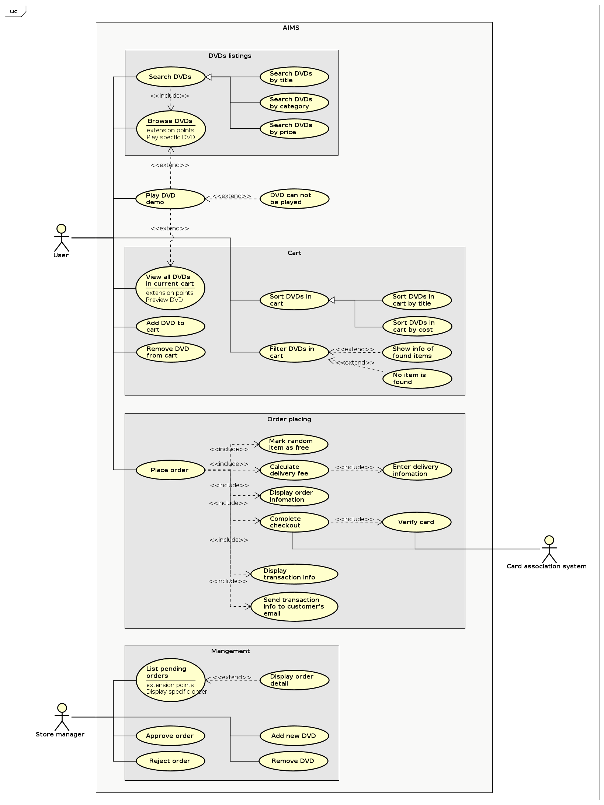
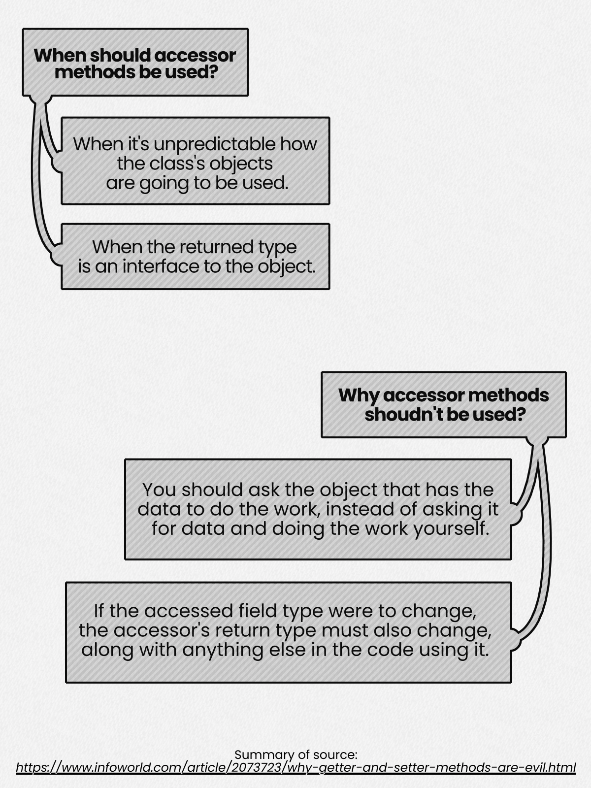

# Week 2 report

## Class diagram

## Use case diagram

## Reading assignment mindmap

## Exercises questions

> If you create a constructor method to build a DVD by title then create a
> constructor method to build a DVD by category.
> Does JAVA allow you to do this?

No, because both of the constructors would have the same signature
(accepting only String as the first parameter).
