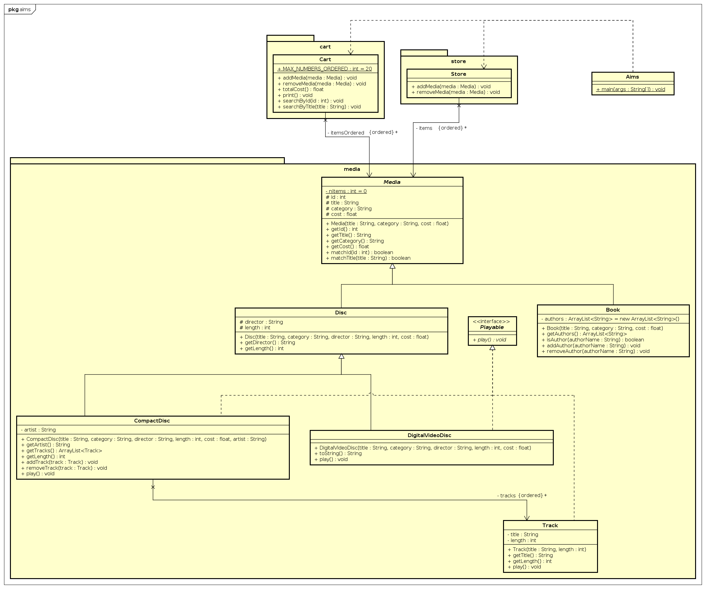

# Lab 04

## Class diagram



## Questions

> Suppose we are taking this Comparable interface approach.
> - What class should implement the Comparable interface?

The `Media` should implement this interface.

> - In those classes, how should you implement the compareTo() method be to
> reflect the ordering that we want?

```java
@Override
public int compareTo(Media other) {
  return Comparator.comparing(Media::getTitle)
    .thenComparingDouble(Media::getCost)
    .compare(this, other);
}
```

> - Can we have two ordering rules of the item (by title then cost and by cost
> then title) if we use this Comparable interface approach?

No, we can't, because we can't declare two methods with the same name and the
same signature.

> - Suppose the DVDs has a different ordering rule from the other media types,
> that is by title, then decreasing length, then cost. How would you modify
> your code to allow this?

Another `thenComparing()` can be used to achieve this.
```java
@Override
public int compareTo(DigitalVideoDisc other) {
  return Comparator.comparing(DigitalVideoDisc::getTitle)
    .thenComparingInt(DigitalVideoDisc::getLength)
    .thenComparingDouble(DigitalVideoDisc::getCost)
    .compare(this, other);
}
```
